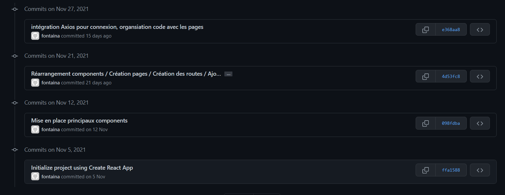

# BookOShop

[](http://forthebadge.com)

---

Application pour échanger des livres sans argent.

## Getting Started

This project was bootstrapped with [Create React App](https://github.com/facebook/create-react-app).

### Prerequisites

Things you need to install the software and how to install

```
$ yarn install
$ yarn start

```

## Running the tests

Not Available

## Deployment

`yarn start`

Runs the app in the development mode.\
Open [http://localhost:3000](http://localhost:3000) to view it in the browser.

The page will reload if you make edits.\
You will also see any lint errors in the console.

## Built With

`yarn build`

Builds the app for production to the `build` folder.\
See the section about [deployment](https://facebook.github.io/create-react-app/docs/deployment) for more information.

## Versioning

**Dernière version stable :** 1.0

Liste des versions : [Cliquer pour afficher](https://github.com/M-Belle/library-front)

Alice avait commencée la partie Front puis Maxence l'as repris pour intégrer Axios et faire le lien avec le Back.
Voici la capture des commits d'Alice : 


## Authors

- **BELLE Maxence - E4 - ESTIAM** - \_[M-Belle](https://github.com/M-Belle)
- **FAURE Alice - E4 - ESTIAM** - \_[MissMug](https://github.com/MissMug)

## License

Not Available

## Acknowledgments

- **DJALADIAN Guévork** - \_[Guevork-Pro](https://github.com/Guevork-Pro)
